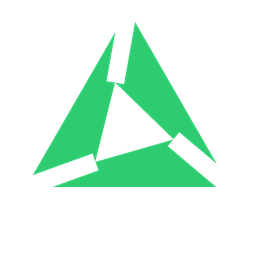

# ollama-host-toggle

A tiny Windows **system-tray app + tailnet HTTP control agent** that toggles **Ollama model hosting** on a GPU machine — start/stop serving, preload/unload models, and free the GPU on demand.

Flip your box between **"AI host"** and **"all-mine"** (gaming, rendering) from the tray, or remotely over your [Tailscale](https://tailscale.com) tailnet so another machine can wake it for heavy jobs and stand it down when idle.

The tray icon is drawn at runtime and tinted by status:  serving + model loaded ·  serving, idle ·  off.

## Why this exists / prior art
Off-the-shelf Ollama tray tools are chat clients; none control *hosting* on/off with a remote agent. The nearest projects each cover only one slice:
- [`Superjulien/Ollama_control`](https://github.com/Superjulien/Ollama_control) — interactive **CLI** menu (start/stop/launch). No tray, no remote API.
- [`yonie/ollama-monitor`](https://github.com/yonie/ollama-monitor) — **console** VRAM/GPU monitor. Read-only, no control.
- [duganth's gist](https://gist.github.com/duganth/a10b0de42a8812a634cb0ee816c729a8) — Windows-service + Tailscale gaming toggle. Config only, no app/API/status.

`ollama-host-toggle` is the only one combining **tray UI + token-gated tailnet API + VRAM-aware status + hosting toggle**.

## Features
- **Tray icon + tooltip** with live status (serving? model loaded? VRAM used?).
- **Tray menu:** start hosting (pick a model), stop hosting, unload, refresh, **Start at login** toggle, open hub status.
- **Token-gated HTTP API** on the tailnet (`/state`, `/host/on`, `/host/off`, `/preload`, `/unload`).
- **Scheduled on/off:** config rules like "serve weekday mornings, free the GPU every night."
- **First-run setup:** auto-creates `config.toml` with a generated token + detected tailnet IP — clone and run.
- **Desktop notifications** when hosting starts/stops or a model loads (covers tray *and* remote actions).
- **Single-instance** guard; **windowless** autostart.

## Install / run
See **[INSTALL.md](INSTALL.md)**. Short version:
```powershell
pip install -r requirements.txt
pythonw -m ollama_host_toggle      # first run writes config.toml + a token
```
Then right-click the tray icon → **Start at login** to autostart, or build a single `.exe` (see INSTALL).

## HTTP API (tailnet-only, token-gated)
Bound to your tailnet IP on port `11435`; every request needs `Authorization: Bearer <auth_token>`.

| Method | Path        | Body                         | Action                              |
|--------|-------------|------------------------------|-------------------------------------|
| GET    | `/state`    | —                            | full hosting state JSON             |
| POST   | `/host/on`  | `{"preload":"qwen2.5:14b"}`? | start serving + preload             |
| POST   | `/host/off` | —                            | stop Ollama, free VRAM              |
| POST   | `/preload`  | `{"model":"..."}`            | load a model hot (`keep_alive:-1`)  |
| POST   | `/unload`   | `{"model":"..."}`?           | drop a model from VRAM              |

`GET /state` →
```json
{"host":"my-gpu-box","ollamaRunning":true,"ollamaVersion":"0.x.y",
 "loadedModels":["qwen2.5:14b"],"vramUsedMB":12156,"vramTotalMB":16303,
 "serving":true,"ts":"..."}
```

## Layout
- `ollama_host_toggle/actions.py` — start/stop/status/preload/unload (Ollama API + nvidia-smi)
- `ollama_host_toggle/http_api.py` — token-gated tailnet HTTP API
- `ollama_host_toggle/tray.py` — pystray UI + background poll + notifications
- `ollama_host_toggle/autostart.py` — Start-at-login shortcut management
- `ollama_host_toggle/config.py` — config loader + first-run setup + tailnet IP detection

## Remote control from another host
Any always-on machine can drive this over the tailnet — see **[REMOTE-CONTROL.md](REMOTE-CONTROL.md)** for direct calls and an example reverse-proxy (Node/Express). The pattern: `GET <agent>/state` and `POST <agent>/host/on|off` with the bearer token.
